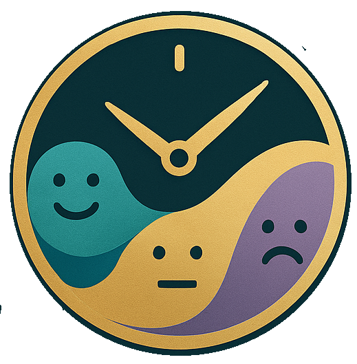

<p align="center">
  
</p>

# Mood Flow

Mood Flow adalah aplikasi web berbasis [Next.js](https://nextjs.org) yang membantu pengguna memantau mood harian, mengelola rutinitas, dan fokus mingguan secara personal. Aplikasi ini memanfaatkan Prisma ORM, autentikasi JWT, dan UI modern dengan Tailwind CSS.

---

## Fitur Utama

- **Register & Login**  
  Autentikasi aman menggunakan JWT dan cookie.

- **Dashboard**  
  Menampilkan menu utama: Mood Check, Rutinitas, dan Weekly Focus.

- **Mood Check**  
  Pilih mood harian dari daftar mood yang sudah pernah dicatat, lalu tampilkan rutinitas yang sesuai dengan mood tersebut.

- **Rutinitas**  
  - Lihat daftar rutinitas yang sudah dibuat.
  - Tambah rutinitas baru, pilih mood yang sudah ada atau buat mood baru.
  - Rutinitas otomatis dikelompokkan ke dalam MoodBox sesuai mood.

- **Weekly Focus**  
  Kelola fokus mingguan dan rutinitas yang harus dikerjakan minggu ini.

- **Relasi Data Otomatis**  
  - MoodBox otomatis dibuat jika mood baru ditambahkan.
  - Setiap rutinitas terhubung ke MoodBox dan WeeklyFocus.

---

## Teknologi

- [Next.js App Router](https://nextjs.org/docs/app)
- [React](https://react.dev/)
- [Prisma ORM](https://www.prisma.io/)
- [PostgreSQL](https://www.postgresql.org/)
- [Tailwind CSS](https://tailwindcss.com/)
- [pnpm](https://pnpm.io/)
- [jose](https://github.com/panva/jose) (JWT di Edge Runtime)

---

## Instalasi & Menjalankan

1. **Clone repo & install dependencies**
    ```bash
    pnpm install
    ```

2. **Atur environment variable**
    - Salin `.env.example` ke `.env` dan isi `DATABASE_URL` serta `JWT_SECRET`.

3. **Migrasi database & generate Prisma Client**
    ```bash
    npx prisma migrate dev
    npx prisma generate
    ```

4. **Jalankan aplikasi**
    ```bash
    pnpm dev
    ```
    Buka [http://localhost:3000](http://localhost:3000)

---

## Struktur Folder Penting

- `/src/app` — Halaman utama, dashboard, API route
- `/src/components` — Komponen UI (form, button, dsb)
- `/src/libs` — Prisma, autentikasi, helper session
- `/prisma/schema.prisma` — Skema database

---

## Pengembangan

- Edit halaman di `/src/app`
- Edit komponen di `/src/components`
- Edit skema database di `/prisma/schema.prisma` lalu jalankan `npx prisma migrate dev`

---

## Lisensi

Aplikasi ini dikembangkan untuk pembelajaran dan pengembangan pribadi.

---

## Kontribusi

Silakan buat issue atau pull request jika ingin berkontribusi atau menemukan bug.

---
